# Elasticsearch Tool

A lightweight Elasticsearch Administration Platform built with Django and Elasticsearch.

Designed to provide an intuitive alternative administration interface for monitoring clusters, managing snapshots, users, nodes and Elasticsearch resources through a modern web interface.
---

## Features

### Cluster Management

- Multi-cluster support
- Cluster health monitoring
- Cluster overview dashboard
- Node monitoring
- Shard monitoring

### User Administration

- User management
- User details explorer
- Role visualization

### Index Management

- Index explorer
- Index statistics
- Index disk usage monitoring

### Snapshot Management

- Snapshot repository creation
- Snapshot browsing
- Snapshot creation
- Repository Explorer
- Snapshot property viewer

### Monitoring

- Cluster monitoring
- Node monitoring
- Shard allocation overview
- Disk usage analysis

---

## Dashboard

Access the application:

http://localhost:9000
---

## Screenshots

### Multi-cluster Support

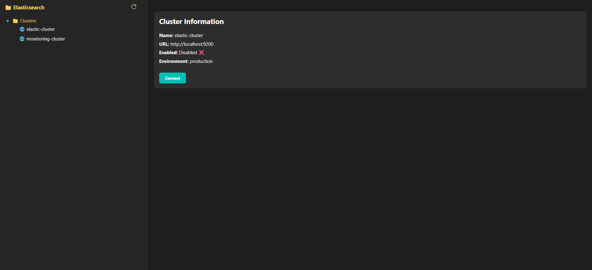

### Users Management

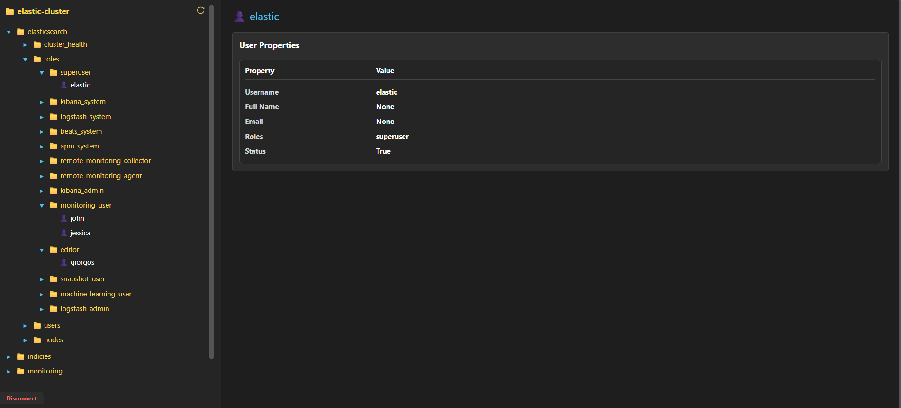
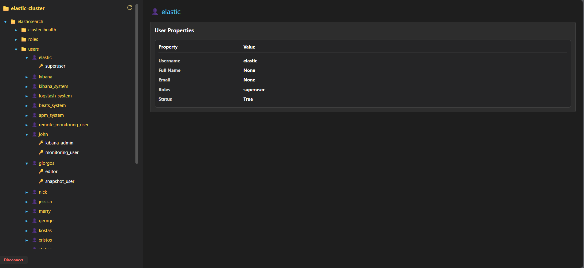

### Health Management
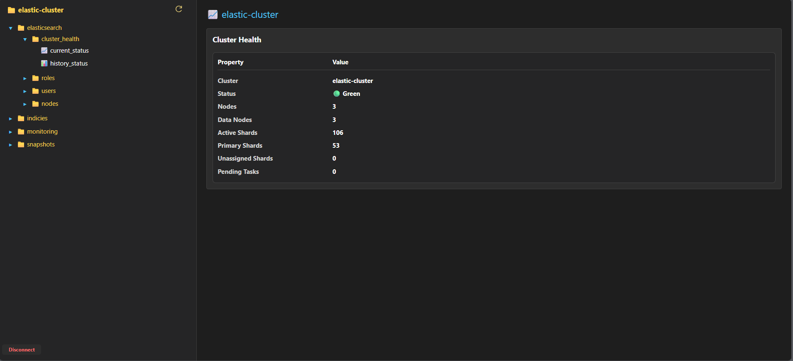
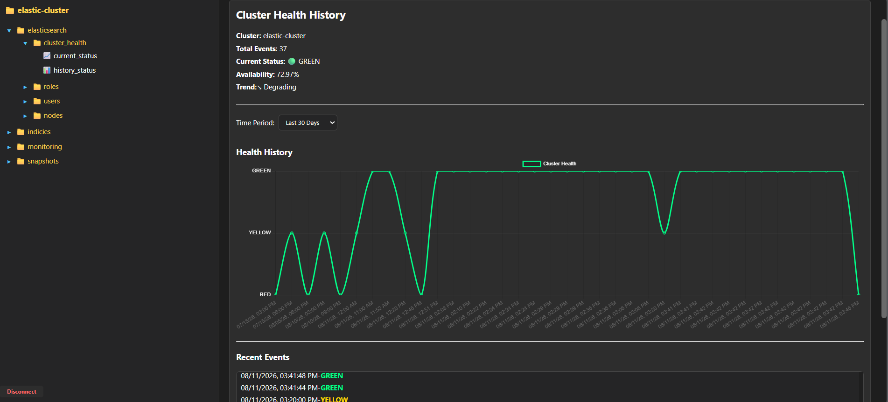

### Snapshots Management
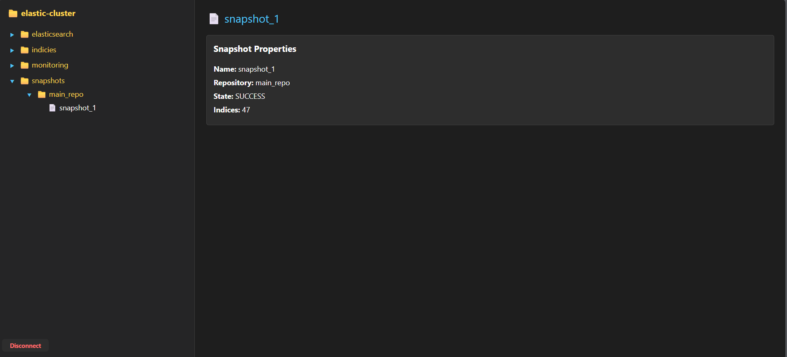

### Cluster Monitoring

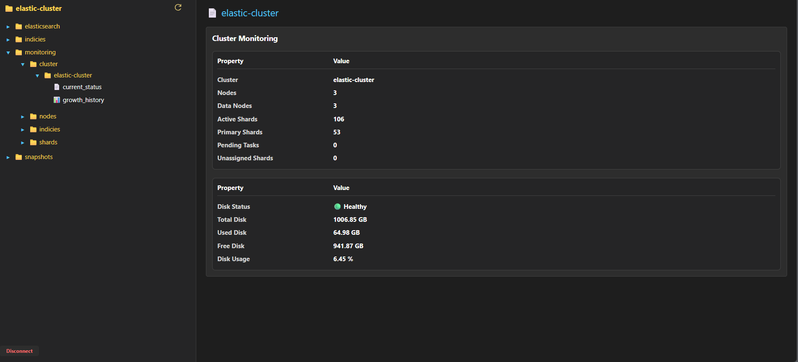
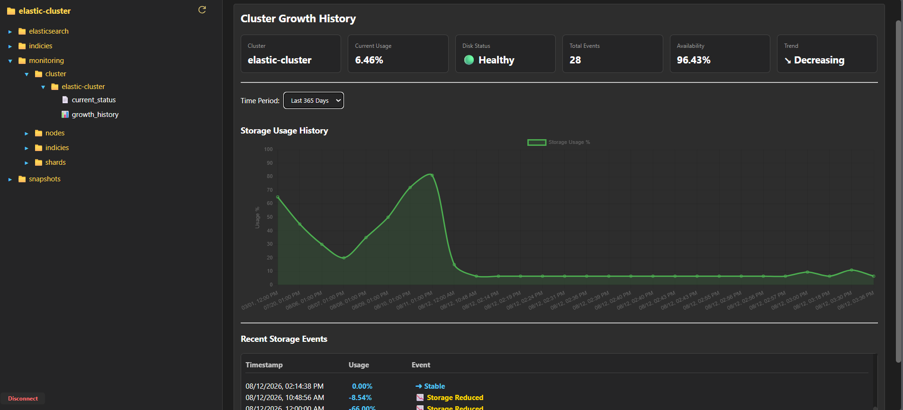

### Node Monitoring
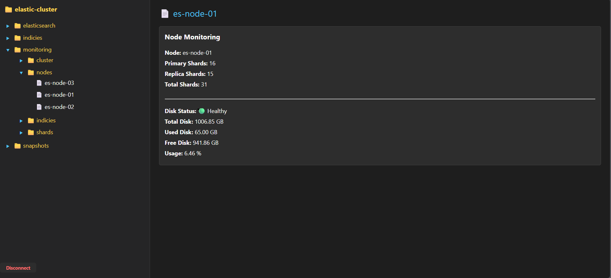
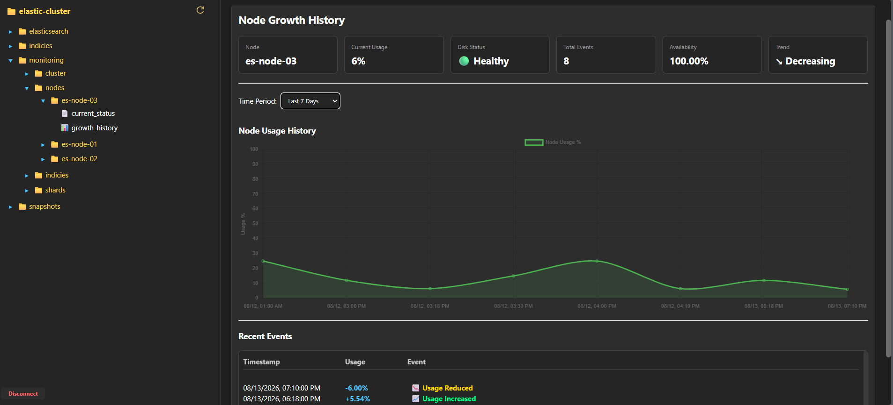

### Index Monitoring
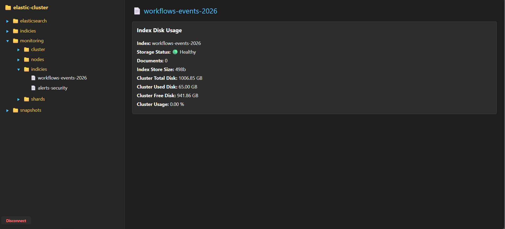
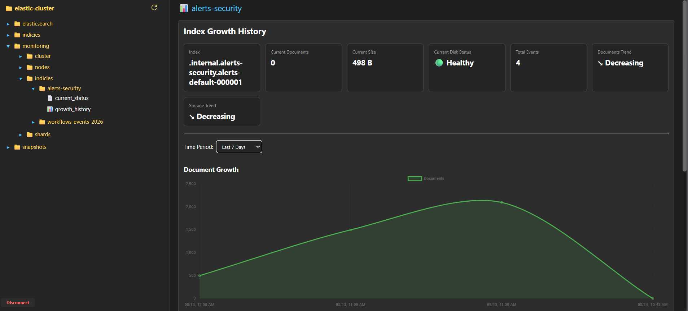
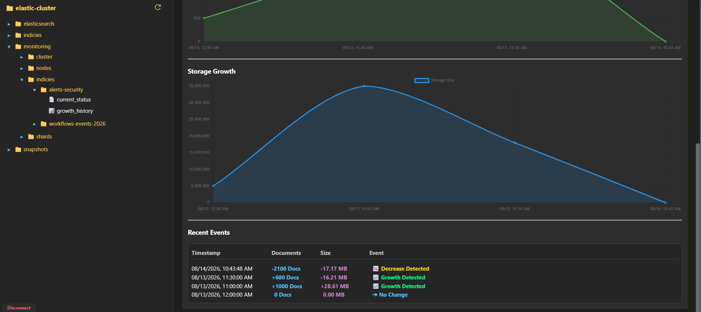

### Shard Monitoring
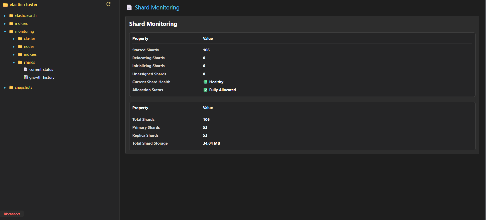
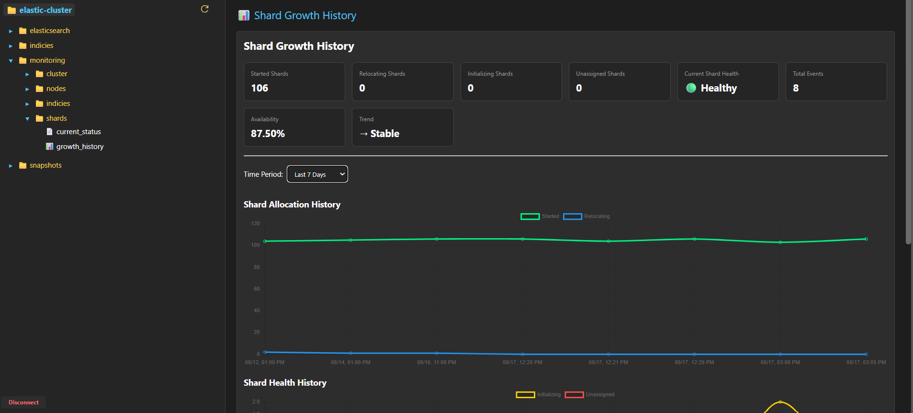
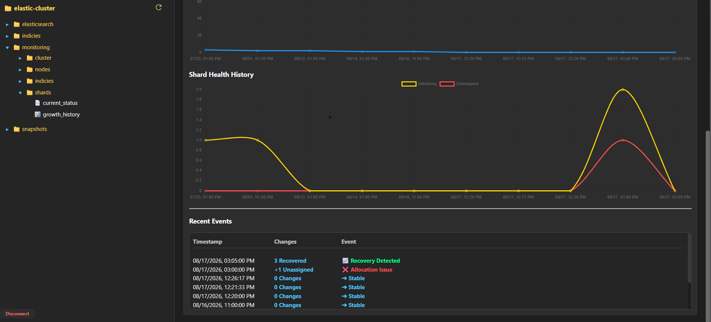
---

## Historical Monitoring

Elasticsearch Tool includes built-in historical monitoring capabilities.

The application automatically creates hidden Elasticsearch indices to store monitoring data:

```text
.cluster-health-history
.cluster-storage-history
.cluster-node-history
.cluster-index-history
.cluster-shard-history
```

### Available Historical Dashboards

- Cluster Health History
- Cluster Growth History
- Node Growth History
- Index Growth History
- Shard Growth History

### Features

- Automatic historical data collection
- Trend analysis
- Availability metrics
- Recent events tracking
- Interactive charts
- Native Elasticsearch storage

No external database or manual configuration is required.


### Stored Information

Depending on the monitoring type, historical records may include:

```json
{
  "cluster": "elastic-cluster",
  "timestamp": "2026-08-11T10:52:18Z"
}
```

Examples of stored metrics:

- Health status changes
- Storage usage changes
- Node disk usage
- Index growth metrics
- Shard allocation statistics

### Available Metrics

- Current Status
- Historical Timeline
- Trend Analysis
- Availability Metrics
- Growth Monitoring
- Recent Events
- Interactive Charts

### Benefits

- Fully automated setup
- No external database required
- Native Elasticsearch storage
- Hidden monitoring indices
- Historical trend analysis
- Growth monitoring
- Scalable for large Elasticsearch environments

## Technology Stack

- Django
- Elasticsearch
- Python
- Docker
- Docker Compose
- HTML
- CSS
- JavaScript

---

## Project Structure

```text
elastic_monitor/

├── Dockerfile
├── requirements.txt
├── .env-example
├── README.md

├── deployment/
│   ├── docker-compose.yml
│   ├── docker-compose-elasticsearch.yml
│   └── elasticsearch.yml

├── config/
├── static/
├── templates/

├── elastic_monitor.py
├── elasticsearch_api.py
├── manage.py
├── views.py
```

---

## Installation

### Clone Repository

```bash
git clone https://github.com/DimitrisFournarakos/Elasticsearch-Tool.git

cd Elasticsearch-Tool
```
---

## Environment Variables

Create a `.env` file based on:

```bash
cp .env-example .env
```

Example:

```env
SECRET_KEY=CHANGE_ME
ELASTIC_PASSWORD=ChangeMe123!
MONITORING_PASSWORD=ChangeMe456!
```

---
## Cluster Configuration

Before using the application, configure the Elasticsearch clusters that you want to monitor.

Make and Edit the `clusters.json` file and add your cluster information.
The clusters.json file must be located in the project root directory.

Example:

```json
{
  "clusters": [
    {
      "id": "prod",
      "name": "elastic-cluster",
      "url": "http://localhost:9200",
      "username": "elastic",
      "password": "your_password",
      "enabled": true,
      "environment": "production"
    },
    {
      "id": "monitoring",
      "name": "monitoring-cluster",
      "url": "http://localhost:9203",
      "username": "elastic",
      "password": "your_password",
      "enabled": true,
      "environment": "monitoring"
    }
  ]
}
```

### Field Description

| Field | Description |
|---------|---------|
| id | Unique cluster identifier |
| name | Cluster display name |
| url | Elasticsearch endpoint URL |
| username | Elasticsearch username |
| password | Elasticsearch password |
| enabled | Enable or disable the cluster |
| environment | Environment type (production, monitoring, development, etc.) |

After updating `clusters.json`, restart the application.

## Docker Deployment

Build application:

```bash
docker build -t elasticsearch-tool .
```

Run application:

```bash
docker compose -f deployment/docker-compose.yml up -d
```

Open:

```text
http://localhost:9000
```

---

## Elasticsearch Demo Environment

Start demo Elasticsearch clusters:

```bash
docker compose -f deployment/docker-compose-elasticsearch.yml up -d
```

This deploys:

- elastic-cluster
- monitoring-cluster

with snapshot repository support enabled.

---

## Snapshot Repository Support

The demo environment includes:

```yaml
path.repo:
  - /usr/share/elasticsearch/snapshots
```

allowing:

- Repository Creation
- Snapshot Creation
- Snapshot Restore
- Repository Explorer


---

## Author

Dimitrios Fournarakos

GitHub:
https://github.com/DimitrisFournarakos

---

## License

Copyright © 2026 Dimitrios Fournarakos.

All Rights Reserved.

This project is not licensed for public use, modification, redistribution, or commercial exploitation without explicit written permission from the author.